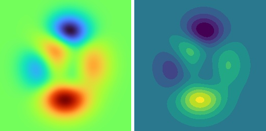

# vito - Vision Tools
[](https://pypi.org/project/vito)
[](https://travis-ci.com/snototter/vito)
[](https://coveralls.io/github/snototter/vito?branch=master)
[](https://github.com/snototter/vito/blob/master/LICENSE?raw=true)

Python utilities for common computer vision tasks.
The goal of this package is to provide a lightweight package helping you with standard/recurring image manipulation tasks.


## Examples
* **Pseudocoloring:** Standard monochrome image and 16-bit depth image.
  ```python
  from vito import imutils
  from vito import imvis

  # Load a single-channel image (data.dtype will be numpy.uint8)
  peaks = imutils.imread('peaks.png', mode='L')
  # Colorize it
  colorized = imvis.pseudocolor(peaks, limits=None, color_map=colormaps.colormap_viridis_rgb)
  imvis.imshow(colorized)

  # Load 16-bit depth stored as PNG (data.dtype will be numpy.int32)
  depth = imutils.imread('depth.png')
  # Colorize it
  colorized = imvis.pseudocolor(depth, limits=None, color_map=colormaps.colormap_turbo_rgb)
  imvis.imshow(colorized)

  ```
  Example visualizations: colorization via the `turbo` rainbow colormap (left); same data reduced to 11 bins colorized using `viridis` (right). Input data is obtained from two translated and scaled Gaussian distributions.
  
* **Optical flow:**
  ```python
  from vito import flowutils
  from vito import imvis

  # Load optical flow file
  flow = flowutils.floread('color_wheel.flo')
  # Colorize it
  colorized = flowutils.colorize_flow(flow)
  imvis.imshow(colorized)
  ```
  Examplary visualization: Optical flow (standard color wheel visualization) and corresponding RGB frame for one frame of the [MPI Sintel Flow](http://sintel.is.tue.mpg.de) dataset.
  
* **Pixelation:**
  ```python
  from vito import anonymization
  from vito import imutils
  from vito import imvis

  img = imutils.imread('faces.jpg')
  face_rects = [(l0, t0, w0, h0), (l1, t1, w1, h1), ... ]
  TODO apply_on_bboxes + pixelate/blur
  ```
* For more examples (or if you prefer having a simple GUI to change visualization/analyse your data), see also the [**iminspect**](https://pypi.org/project/iminspect) package (which uses `vito` under the hood).


## Dependencies
* `numpy`
* `Pillow`


## Changelog
* `1.1.1`
  * Maximum alpha channel value derived from data type.
* `1.1.0`
  * Added padding functionality.
* `1.0.4`
  * Improved test coverage.
  * Fixed potential future bugs - explicit handling of wrong/unexpected user inputs.
* `1.0.3`
  * Minor bug fix: handle invalid user inputs in `imvis`.
* `1.0.2`
  * Additional tests and minor improvements (potential bug fixes, especially for edge case inputs).
  * Ensure default image I/O parametrization always returns/saves/loads color images as RGB (even if OpenCV is available/used on your system).
* `1.0.1`
  * Fix colorizing boolean masks (where `mask[:] = True` or `mask[:] = False`).
* `1.0.0`
  * Rename flow package to `flowutils`.
* `0.3.2`
  * Rename colorization for optical flow.
* `0.3.1`
  * Fix `colormaps.by_name()` for grayscale.
* `0.3.0`
  * `apply_on_bboxes()` now supports optional kwargs to be passed on to the user-defined function handle.
  * Changed `imread()`'s default `mode` parameter to optional kwargs which are passed on to Pillow.
  * Raising error for non-existing files in `imread()`
  * Added `colormaps.by_name()` functionality.
  * Fixed bounding box clipping off-by-one issue.
  * Added `imutils` tests ensuring proper data types.
* `0.2.0`
  * Optical flow (Middlebury .flo format) I/O and visualization.
  * Support saving images.
  * Colorization to visualize tracking results.
* `0.1.1`
  * Changed supported python versions for legacy tests.
* `0.1.0`
  * First actually useful release.
  * Contains most of the functionality of `pvt` (a library I developed throughout my studies).
    * `cam_projections` - projective geometry, lens distortion/rectification (Plumb Bob model), etc.
    * `colormaps` - colormap definitions for visualization (jet, parula, magma, viridis, etc.)
    * `imutils` - image loading, conversion, RoI handling (e.g. apply functions on several patches of an image).
    * `imvis` - visualization helpers, e.g. pseudocoloring or overlaying images.
    * `pyutils` - common python functions (timing code, string manipulation, list sorting/search, etc.)
* `0.0.1`
  * Initial public release.
  * Contains common python/language and camera projection utils.


## TODO List
* anonymization utils
* augmentation
